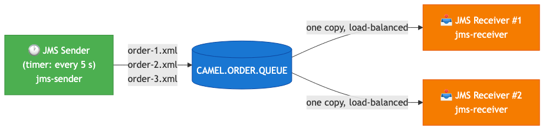
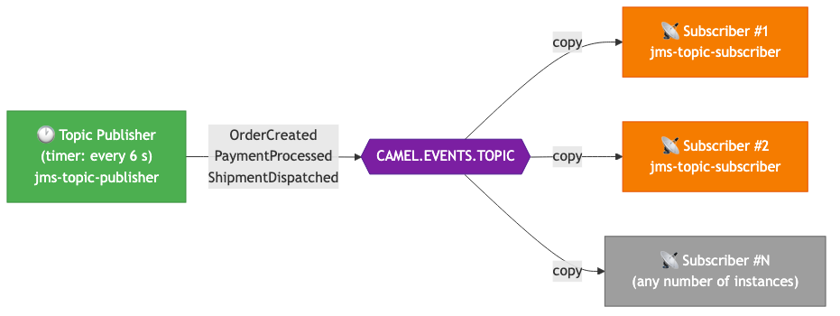
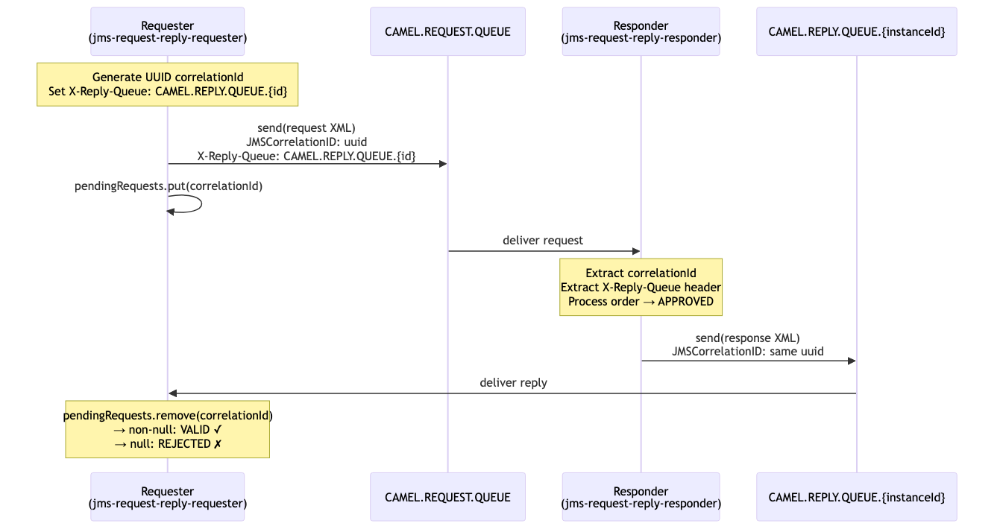

<!-- _class: lead -->

# JMS Messaging Patterns
## Apache Camel + TIBCO EMS 8.5.1

Hands-on demonstration of Point-to-Point, Publish-Subscribe and Request-Reply

---

# Agenda

1. **Setup** — TIBCO EMS, project structure
2. **Point-to-Point (Queue)** — `jms-sender` / `jms-receiver`
3. **Publish-Subscribe (Topic)** — `jms-topic-publisher` / `jms-topic-subscriber`
4. **Request-Reply** — `jms-request-reply-requester` / `jms-request-reply-responder`
5. **Pattern Comparison**

---

# Setup: TIBCO EMS in Docker

```bash
cd messaging/docker
docker compose up -d
```

| Service | Port | Purpose |
|---|---|---|
| TIBCO EMS 8.5.1 | 7222 | JMS broker (TCP) |
| EMS Admin | 7222 | `tibemsadmin` CLI |

**TIBCO EMS creates queues/topics dynamically** — no manual configuration needed.

> **Note**: This module uses **Camel 3.21.4 LTS** (not 4.x) for `javax.jms` compatibility with TIBCO EMS 8.5.1.

---

# Project Structure

| Project | Pattern | Destination |
|---|---|---|
| `jms-sender` | Point-to-Point (send) | `CAMEL.ORDER.QUEUE` |
| `jms-receiver` | Point-to-Point (receive) | `CAMEL.ORDER.QUEUE` |
| `jms-topic-publisher` | Pub-Sub (publish) | `CAMEL.EVENTS.TOPIC` |
| `jms-topic-subscriber` | Pub-Sub (subscribe) | `CAMEL.EVENTS.TOPIC` |
| `jms-request-reply-requester` | Request-Reply (client) | `CAMEL.REQUEST.QUEUE` / `CAMEL.REPLY.QUEUE.{id}` |
| `jms-request-reply-responder` | Request-Reply (server) | `CAMEL.REQUEST.QUEUE` / `CAMEL.REPLY.QUEUE.{id}` |

Build all projects: `cd messaging && mvn clean package`

---

<!-- _class: lead -->

# Pattern 1
## Point-to-Point (Queue)

---

# Point-to-Point: Concept

- **One-to-one delivery** — each message is consumed by exactly one receiver
- Message **persists** in the queue until consumed
- Multiple consumers **load-balance** across messages automatically
- Producer and consumer are **temporally decoupled** — no need to be online simultaneously

**Use cases**: order processing, task queues, reliable command delivery

---

# Point-to-Point: Architecture



Each message goes to **one** receiver. With two receivers running, messages are distributed round-robin.

---

# Point-to-Point: Sender Route

```java
// Loads order-1.xml, order-2.xml, order-3.xml from classpath and cycles through them
from("timer:sender?period=5000")
    .process(exchange -> {
        String xml = orderFiles[counter++ % orderFiles.length];
        exchange.getIn().setBody(xml);
    })
    .log("Sending to queue [${header.orderFile}]: ${body}")
    .to("jms:queue:{{jms.queue.name}}");
```

XML order payload:
```xml
<order xmlns="http://tutorial.camel.com/orders">
  <orderId>ORD-001</orderId>
  <customer><name>Acme Corporation</name></customer>
  <total>329.89</total>
</order>
```

---

# Point-to-Point: Receiver Route

```java
from("jms:queue:{{jms.queue.name}}")
    .log("Received message from queue... Order ID: ${body}");
```

**Expected output (two receivers running):**
```
[Receiver #1] Received: <order><orderId>ORD-001</orderId>...
[Receiver #2] Received: <order><orderId>ORD-002</orderId>...
[Receiver #1] Received: <order><orderId>ORD-003</orderId>...
```

> **Key observation**: Each message goes to only one receiver — never both.

---

# Point-to-Point: Demo

**Terminal 1 — Receiver:**
```bash
cd messaging/jms-receiver
mvn exec:java -Dexec.mainClass="com.tutorial.camel.JmsReceiverExample"
```

**Terminal 2 — Sender:**
```bash
cd messaging/jms-sender
mvn exec:java -Dexec.mainClass="com.tutorial.camel.JmsSenderExample"
```

**Terminal 3 — Second Receiver (optional, shows load-balancing):**
```bash
cd messaging/jms-receiver
mvn exec:java -Dexec.mainClass="com.tutorial.camel.JmsReceiverExample"
```

---

<!-- _class: lead -->

# Pattern 2
## Publish-Subscribe (Topic)

---

# Publish-Subscribe: Concept

- **One-to-many delivery** — every subscriber receives a copy of each message
- **No load-balancing** — all active subscribers get all messages
- **Temporal coupling** — subscribers must be running to receive messages (non-durable)
- Publisher has no knowledge of how many subscribers exist

**Use cases**: event broadcasting, notifications, real-time dashboards, audit logging

---

# Publish-Subscribe: Architecture



Every published event is received by **all** active subscribers simultaneously.

---

# Publish-Subscribe: Publisher Route

```java
private static final String[] EVENTS = {
    "OrderCreated", "PaymentProcessed", "ShipmentDispatched",
    "OrderDelivered", "ReturnInitiated"
};

from("timer:publisher?period=6000")
    .process(exchange -> {
        String event = EVENTS[counter++ % EVENTS.length];
        exchange.getIn().setBody("Event: " + event + " - "
            + new java.util.Date());
    })
    .log("[Publisher] Publishing to topic: ${body}")
    .to("jms:topic:{{jms.topic.name}}");
```

---

# Publish-Subscribe: Subscriber Route

```java
from("jms:topic:{{jms.topic.name}}")
    .log("[Subscriber] Received event at "
        + new java.text.SimpleDateFormat("yyyy-MM-dd HH:mm:ss")
            .format(new java.util.Date())
        + ": ${body}");
```

**Expected output (two subscribers running):**
```
[Subscriber #1] Received event at 2026-04-27 22:29:22: Event: OrderCreated - ...
[Subscriber #2] Received event at 2026-04-27 22:29:22: Event: OrderCreated - ...
[Subscriber #1] Received event at 2026-04-27 22:29:28: Event: PaymentProcessed - ...
[Subscriber #2] Received event at 2026-04-27 22:29:28: Event: PaymentProcessed - ...
```

---

# Publish-Subscribe: Demo

**Terminal 1 — Subscriber #1:**
```bash
cd messaging/jms-topic-subscriber
mvn exec:java -Dexec.mainClass="com.tutorial.camel.JmsTopicSubscriberExample"
```

**Terminal 2 — Subscriber #2:**
```bash
cd messaging/jms-topic-subscriber
mvn exec:java -Dexec.mainClass="com.tutorial.camel.JmsTopicSubscriberExample"
```

**Terminal 3 — Publisher:**
```bash
cd messaging/jms-topic-publisher
mvn exec:java -Dexec.mainClass="com.tutorial.camel.JmsTopicPublisherExample"
```

> **Key observation**: Both subscribers receive every event. Queue: only one does.

---

<!-- _class: lead -->

# Pattern 3
## Request-Reply

---

# Request-Reply: Concept

- **Bidirectional** — requester sends a request and expects a response
- Models **RPC-style** communication over asynchronous JMS
- A **Correlation ID** (UUID) links each reply to its request
- Multiple concurrent requesters can share the same request queue safely

**Use cases**: order approval, price lookup, remote service calls, orchestration

---

# Request-Reply: Architecture



---

# Correlation ID — Why It Matters

Without correlation IDs, a shared reply queue causes chaos with multiple requesters:

```
Requester A sends request-1  → reply for request-1 goes to CAMEL.REPLY.QUEUE
Requester B sends request-2  → reply for request-2 goes to CAMEL.REPLY.QUEUE
Requester A reads first message from queue → might get B's reply!
```

**Solution**: Each requester gets its **own reply queue** named `CAMEL.REPLY.QUEUE.{uuid}`.

The queue name is passed to the responder via the **`X-Reply-Queue` custom JMS header**.

> **Why not use the standard `JMSReplyTo`?**
> TIBCO EMS sends an automatic delivery receipt to `JMSReplyTo`, creating a duplicate in the reply queue. Using a custom header bypasses this broker behaviour.

---

# Request-Reply: Requester Route

```java
private final String instanceId = UUID.randomUUID().toString().substring(0, 8);
private final String replyQueueName = "CAMEL.REPLY.QUEUE." + instanceId;
private final Map<String, Long> pendingRequests =
    Collections.synchronizedMap(new ConcurrentHashMap<>());

// Route 1: send requests every 8 seconds
from("timer:requester?period=8000")
    .process(exchange -> {
        String correlationId = UUID.randomUUID().toString();
        exchange.getIn().setHeader("JMSCorrelationID", correlationId);
        exchange.getIn().setHeader("X-Reply-Queue", replyQueueName);
        exchange.getIn().setBody("<request><orderNumber>ORD-"
            + System.currentTimeMillis() % 1000
            + "</orderNumber><status>PENDING</status></request>");
        pendingRequests.put(correlationId, System.currentTimeMillis());
    })
    .to("jms:queue:{{jms.request.queue.name}}?exchangePattern=InOnly");
```

---

# Request-Reply: Requester — Reply Consumer

```java
// Route 2: listen for replies on instance-specific queue
from("jms:queue:" + replyQueueName + "?exchangePattern=InOnly")
    .process(exchange -> {
        String correlationId =
            exchange.getIn().getHeader("JMSCorrelationID", String.class);

        // Atomic remove — thread-safe validation
        Long timestamp = pendingRequests.remove(correlationId);

        if (timestamp != null) {
            exchange.setProperty("valid", true);
        } else {
            exchange.setProperty("valid", false);
            exchange.setProperty("reason",
                "Correlation ID " + correlationId + " not found");
        }
    })
    .choice()
        .when(e -> e.getProperty("valid", Boolean.class))
            .log("VALID reply for CorrelationId: ${header.JMSCorrelationID}")
        .otherwise()
            .log("REJECTED: ${exchangeProperty.reason}")
    .end();
```

---

# Request-Reply: Responder Route

```java
from("jms:queue:{{jms.request.queue.name}}?exchangePattern=InOnly")
    .log("Received request | CorrelationId: ${header.JMSCorrelationID}")
    .process(exchange -> {
        String correlationId =
            exchange.getIn().getHeader("JMSCorrelationID", String.class);
        // Read reply queue from custom header (not JMSReplyTo)
        String replyQueue =
            exchange.getIn().getHeader("X-Reply-Queue", String.class);

        // Extract order number, build response XML
        String response = "<response>"
            + "<orderNumber>" + extractOrderNumber(request) + "</orderNumber>"
            + "<status>APPROVED</status>"
            + "<correlationId>" + correlationId + "</correlationId>"
            + "</response>";

        exchange.getIn().setBody(response);
        exchange.getIn().setHeader("JMSCorrelationID", correlationId);
        exchange.setProperty("replyQueueName", replyQueue);
    })
    .toD("jms:queue:${exchangeProperty.replyQueueName}?exchangePattern=InOnly");
```

---

# Request-Reply: Demo

**Terminal 1 — Responder:**
```bash
cd messaging/jms-request-reply-responder
mvn exec:java -Dexec.mainClass="com.tutorial.camel.JmsRequestReplyResponderExample"
```

**Terminal 2 — Requester #1:**
```bash
cd messaging/jms-request-reply-requester
mvn exec:java -Dexec.mainClass="com.tutorial.camel.JmsRequestReplyRequesterExample"
```

**Terminal 3 — Requester #2 (shows per-instance isolation):**
```bash
cd messaging/jms-request-reply-requester
mvn exec:java -Dexec.mainClass="com.tutorial.camel.JmsRequestReplyRequesterExample"
```

Each requester gets its own `CAMEL.REPLY.QUEUE.{uuid}` — replies never mix.

---

# Request-Reply: Expected Output

**Requester:**
```
Requester [CAMEL.REPLY.QUEUE.3d964236] sending request
  CorrelationId: 6e02d21f-6cb6-4463-81dc-8623e1544fc7
  Body: <request><orderNumber>ORD-873</orderNumber>...

Requester [CAMEL.REPLY.QUEUE.3d964236] received VALID reply
  CorrelationId: 6e02d21f-6cb6-4463-81dc-8623e1544fc7
  Response: <response><orderNumber>ORD-873</orderNumber><status>APPROVED</status>...
```

**Responder:**
```
Responder received request
  CorrelationId: 6e02d21f-6cb6-4463-81dc-8623e1544fc7

Responder sending reply to CAMEL.REPLY.QUEUE.3d964236
  CorrelationId: 6e02d21f-6cb6-4463-81dc-8623e1544fc7
```

---

# Pattern Comparison

| Aspect | Queue (P2P) | Topic (Pub-Sub) | Request-Reply |
|---|---|---|---|
| **Delivery** | One consumer per message | All subscribers get a copy | Requester gets its own reply |
| **Coupling** | Loose | Loose | Tighter (waits for reply) |
| **Direction** | One-way | One-way broadcast | Bidirectional |
| **Persistence** | Until consumed | Lost if no subscriber | Both directions persisted |
| **Concurrency** | Multiple consumers load-balance | All receive independently | Per-requester reply queue |
| **Destination** | `CAMEL.ORDER.QUEUE` | `CAMEL.EVENTS.TOPIC` | `CAMEL.REQUEST.QUEUE` + `CAMEL.REPLY.QUEUE.{id}` |
| **Use case** | Task distribution | Event broadcast | RPC, service calls |

---

# Key Implementation Points

## TIBCO EMS specifics
- **Dynamic destinations**: queues and topics created on first use (wildcard `>` in EMS config)
- **`javax.jms` namespace**: requires Camel 3.21.4 LTS (Camel 4.x uses `jakarta.jms`)
- **Delivery receipts**: TIBCO EMS sends an auto-receipt to `JMSReplyTo` — use a custom `X-Reply-Queue` header instead

## Camel JMS patterns
- `exchangePattern=InOnly` on producers: fire-and-forget, no reply queue created
- `exchangePattern=InOnly` on consumers: route processes message without trying to send a reply back
- `toD()` for dynamic destinations: evaluates endpoint URI at runtime
- `ConcurrentHashMap.remove()` for atomic, thread-safe correlation validation

---

<!-- _class: lead -->

# Summary

**Three fundamental JMS messaging patterns demonstrated with Apache Camel and TIBCO EMS:**

| | Queue | Topic | Request-Reply |
|---|---|---|---|
| Delivery | 1:1 | 1:N | 1:1 bidirectional |
| Projects | sender / receiver | publisher / subscriber | requester / responder |

**Next steps:**
- Add message transformation (XML → JSON)
- Implement dead-letter queue error handling
- Add message selectors / filtering
- Explore durable topic subscriptions
